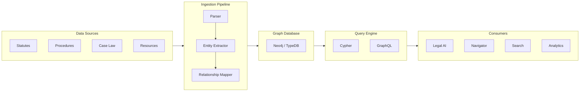

# :books: Justice Knowledge Graph — Connect Laws, Cases, People, and Processes

[](LICENSE)
[](https://www.typescriptlang.org/)
[](CONTRIBUTING.md)
[](https://github.com/dougdevitre/justice-knowledge-graph/pulls)

## The Problem

Legal knowledge is siloed -- statutes live in one system, procedures in another, case law is scattered across databases, and community resources are disconnected from all of it. AI cannot reason about law without connected data, and people cannot navigate the legal system without understanding how all these pieces relate to each other.

## The Solution

An open graph database connecting laws, procedures, case types, resources, and jurisdictions into a single queryable knowledge layer. It breaks down silos, enables smarter AI reasoning, and powers search and navigation across the entire Justice OS ecosystem.

## Architecture



## Who This Helps

- **Legal AI developers** -- structured data for RAG and reasoning
- **Court researchers** -- explore relationships between laws and outcomes
- **Policy analysts** -- trace legislative impact across jurisdictions
- **Justice tech platforms** -- shared data layer for interoperability
- **Law libraries** -- modernize cataloging with linked data

## Features

- **Connected graph of laws, procedures, and case types** -- every legal concept linked to related concepts
- **Jurisdiction-aware relationships** -- understand which laws apply where and how they interact
- **Open query API (GraphQL + Cypher)** -- flexible querying for any consumer application
- **Ingestion pipeline for legal data sources** -- automated parsing and graph construction
- **Entity extraction and linking** -- NLP-powered identification of legal entities and relationships
- **Version tracking for law changes** -- track amendments, repeals, and superseding statutes over time

## Quick Start

```bash
npm install @justice-os/knowledge-graph
```

```typescript
import { GraphDatabase, QueryEngine } from '@justice-os/knowledge-graph';

// Connect to the graph database
const db = new GraphDatabase({
  uri: process.env.NEO4J_URI,
  credentials: {
    username: process.env.NEO4J_USER,
    password: process.env.NEO4J_PASS,
  },
});

const query = new QueryEngine(db);

// Find eviction procedures in Missouri
const results = await query.findByType('Procedure', {
  jurisdiction: 'MO',
  caseType: 'eviction',
});

console.log(`Found ${results.nodes.length} procedures`);

// Explore related statutes
for (const proc of results.nodes) {
  const statutes = await query.findRelated(proc.id, 'REFERENCES');
  console.log(`${proc.name}: ${statutes.length} related statutes`);
}

// Find the shortest path between two legal concepts
const path = await query.shortestPath('RSMo-535.010', 'eviction-defense-procedure');
console.log(`Path: ${path.nodes.map((n) => n.name).join(' -> ')}`);
```

## Roadmap

- [ ] Federal statute ingestion pipeline (USC, CFR)
- [ ] Case law integration with citation graph
- [ ] Real-time legislative update feeds
- [ ] Multi-jurisdiction comparison queries
- [ ] Embedding-based semantic similarity search
- [ ] FHIR-style interoperability standard for legal data

## Project Structure

```
src/
├── index.ts
├── graph/
│   ├── database.ts           # GraphDatabase class — connection, CRUD
│   ├── schema.ts             # GraphSchema — node/edge type definitions
│   └── query-engine.ts       # QueryEngine — Cypher/GraphQL queries
├── ingestion/
│   ├── pipeline.ts           # IngestionPipeline — orchestrator
│   ├── statute-parser.ts     # StatuteParser — parse legal statutes
│   ├── entity-extractor.ts   # EntityExtractor — NLP entities
│   └── relationship-mapper.ts # RelationshipMapper — connect entities
├── api/
│   ├── graphql-api.ts        # GraphQL API for consumers
│   └── rest-api.ts           # REST endpoints
├── versioning/
│   └── change-tracker.ts     # ChangeTracker — law amendments
└── types/
    └── index.ts
```

---

## Justice OS Ecosystem

This repository is part of the **Justice OS** open-source ecosystem — 32 interconnected projects building the infrastructure for accessible justice technology.

### Core System Layer
| Repository | Description |
|-----------|-------------|
| [justice-os](https://github.com/dougdevitre/justice-os) | Core modular platform — the foundation |
| [justice-api-gateway](https://github.com/dougdevitre/justice-api-gateway) | Interoperability layer for courts |
| [legal-identity-layer](https://github.com/dougdevitre/legal-identity-layer) | Universal legal identity and auth |
| [case-continuity-engine](https://github.com/dougdevitre/case-continuity-engine) | Never lose case history across systems |
| [offline-justice-sync](https://github.com/dougdevitre/offline-justice-sync) | Works without internet — local-first sync |

### User Experience Layer
| Repository | Description |
|-----------|-------------|
| [justice-navigator](https://github.com/dougdevitre/justice-navigator) | Google Maps for legal problems |
| [mobile-court-access](https://github.com/dougdevitre/mobile-court-access) | Mobile-first court access kit |
| [cognitive-load-ui](https://github.com/dougdevitre/cognitive-load-ui) | Design system for stressed users |
| [multilingual-justice](https://github.com/dougdevitre/multilingual-justice) | Real-time legal translation |
| [voice-legal-interface](https://github.com/dougdevitre/voice-legal-interface) | Justice without reading or typing |
| [legal-plain-language](https://github.com/dougdevitre/legal-plain-language) | Turn legalese into human language |

### AI + Intelligence Layer
| Repository | Description |
|-----------|-------------|
| [vetted-legal-ai](https://github.com/dougdevitre/vetted-legal-ai) | RAG engine with citation validation |
| [justice-knowledge-graph](https://github.com/dougdevitre/justice-knowledge-graph) | Open data layer for laws and procedures |
| [legal-ai-guardrails](https://github.com/dougdevitre/legal-ai-guardrails) | AI safety SDK for justice use |
| [emotional-intelligence-ai](https://github.com/dougdevitre/emotional-intelligence-ai) | Reduce conflict, improve outcomes |
| [ai-reasoning-engine](https://github.com/dougdevitre/ai-reasoning-engine) | Show your work for AI decisions |

### Infrastructure + Trust Layer
| Repository | Description |
|-----------|-------------|
| [evidence-vault](https://github.com/dougdevitre/evidence-vault) | Privacy-first secure evidence storage |
| [court-notification-engine](https://github.com/dougdevitre/court-notification-engine) | Smart deadline and hearing alerts |
| [justice-analytics](https://github.com/dougdevitre/justice-analytics) | Bias detection and disparity dashboards |
| [evidence-timeline](https://github.com/dougdevitre/evidence-timeline) | Evidence timeline builder |

### Tools + Automation Layer
| Repository | Description |
|-----------|-------------|
| [court-doc-engine](https://github.com/dougdevitre/court-doc-engine) | TurboTax for legal filings |
| [justice-workflow-engine](https://github.com/dougdevitre/justice-workflow-engine) | Zapier for legal processes |
| [pro-se-toolkit](https://github.com/dougdevitre/pro-se-toolkit) | Self-represented litigant tools |
| [justice-score-engine](https://github.com/dougdevitre/justice-score-engine) | Access-to-justice measurement |
| [justice-app-generator](https://github.com/dougdevitre/justice-app-generator) | No-code builder for justice tools |

### Quality + Testing Layer
| Repository | Description |
|-----------|-------------|
| [justice-persona-simulator](https://github.com/dougdevitre/justice-persona-simulator) | Test products against real human realities |
| [justice-experiment-lab](https://github.com/dougdevitre/justice-experiment-lab) | A/B testing for justice outcomes |

### Adoption Layer
| Repository | Description |
|-----------|-------------|
| [digital-literacy-sim](https://github.com/dougdevitre/digital-literacy-sim) | Digital literacy simulator |
| [legal-resource-discovery](https://github.com/dougdevitre/legal-resource-discovery) | Find the right help instantly |
| [court-simulation-sandbox](https://github.com/dougdevitre/court-simulation-sandbox) | Practice before the real thing |
| [justice-components](https://github.com/dougdevitre/justice-components) | Reusable component library |
| [justice-dev-starter-kit](https://github.com/dougdevitre/justice-dev-starter-kit) | Ultimate boilerplate for justice tech builders |

> Built with purpose. Open by design. Justice for all.
