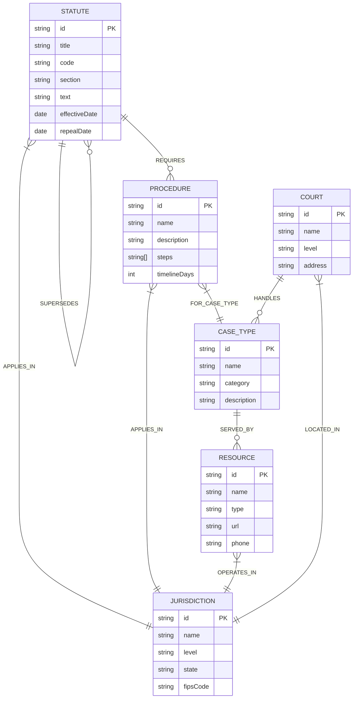
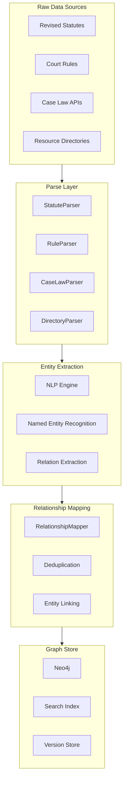
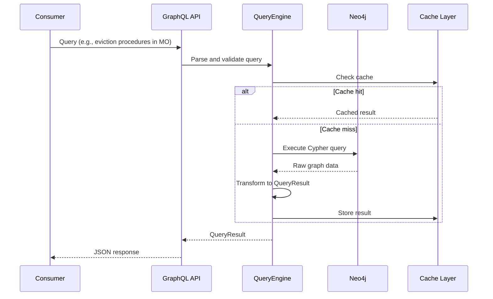
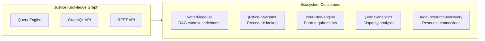
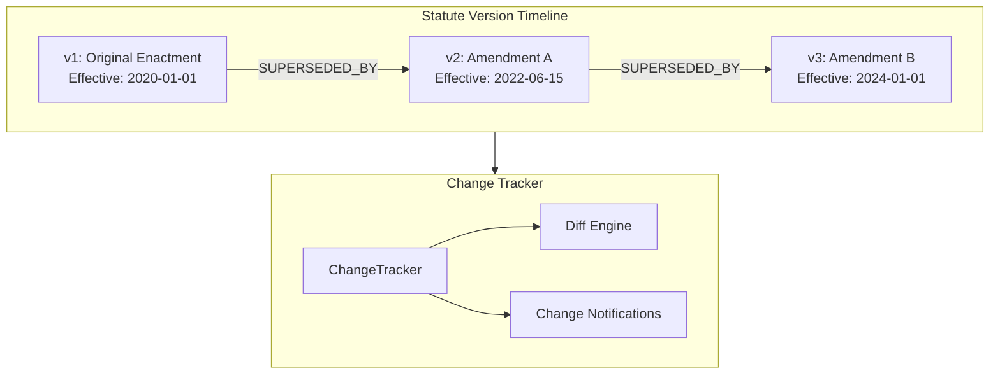

# Justice Knowledge Graph — Architecture

## Graph Data Model

```mermaid
erDiagram
    STATUTE ||--o{ PROCEDURE : "REQUIRES"
    STATUTE ||--o{ STATUTE : "REFERENCES"
    STATUTE ||--o{ STATUTE : "SUPERSEDES"
    STATUTE }|--|| JURISDICTION : "APPLIES_IN"
    PROCEDURE }|--|| JURISDICTION : "APPLIES_IN"
    PROCEDURE }|--|| CASE_TYPE : "FOR_CASE_TYPE"
    CASE_TYPE ||--o{ RESOURCE : "SERVED_BY"
    RESOURCE }|--|| JURISDICTION : "OPERATES_IN"
    COURT }|--|| JURISDICTION : "LOCATED_IN"
    COURT ||--o{ CASE_TYPE : "HANDLES"

    STATUTE {
        string id PK
        string title
        string code
        string section
        string text
        date effectiveDate
        date repealDate
    }

    PROCEDURE {
        string id PK
        string name
        string description
        string[] steps
        int timelineDays
    }

    CASE_TYPE {
        string id PK
        string name
        string category
        string description
    }

    JURISDICTION {
        string id PK
        string name
        string level
        string state
        string fipsCode
    }

    RESOURCE {
        string id PK
        string name
        string type
        string url
        string phone
    }

    COURT {
        string id PK
        string name
        string level
        string address
    }
```

## Ingestion Pipeline

```mermaid
flowchart TB
    subgraph Sources["Raw Data Sources"]
        RS[Revised Statutes]
        CR[Court Rules]
        CL[Case Law APIs]
        RD[Resource Directories]
    end

    subgraph Parse["Parse Layer"]
        SP[StatuteParser]
        RP[RuleParser]
        CP[CaseLawParser]
        DP[DirectoryParser]
    end

    subgraph Extract["Entity Extraction"]
        NLP[NLP Engine]
        NER[Named Entity Recognition]
        RE[Relation Extraction]
    end

    subgraph Map["Relationship Mapping"]
        RM[RelationshipMapper]
        DD[Deduplication]
        LK[Entity Linking]
    end

    subgraph Store["Graph Store"]
        NEO[Neo4j]
        IDX[Search Index]
        VER[Version Store]
    end

    Sources --> Parse
    Parse --> Extract
    Extract --> Map
    Map --> Store
```

## Query Flow

```mermaid
sequenceDiagram
    participant C as Consumer
    participant GQL as GraphQL API
    participant QE as QueryEngine
    participant DB as Neo4j
    participant Cache as Cache Layer

    C->>GQL: Query (e.g., eviction procedures in MO)
    GQL->>QE: Parse and validate query
    QE->>Cache: Check cache
    alt Cache hit
        Cache-->>QE: Cached result
    else Cache miss
        QE->>DB: Execute Cypher query
        DB-->>QE: Raw graph data
        QE->>QE: Transform to QueryResult
        QE->>Cache: Store result
    end
    QE-->>GQL: QueryResult
    GQL-->>C: JSON response
```

## Consumer Integration

```mermaid
flowchart LR
    subgraph KnowledgeGraph["Justice Knowledge Graph"]
        QE[Query Engine]
        GQL[GraphQL API]
        REST[REST API]
    end

    subgraph Consumers["Ecosystem Consumers"]
        VLA[vetted-legal-ai<br/>RAG context enrichment]
        JN[justice-navigator<br/>Procedure lookup]
        CDE[court-doc-engine<br/>Form requirements]
        JA[justice-analytics<br/>Disparity analysis]
        LRD[legal-resource-discovery<br/>Resource connections]
    end

    KnowledgeGraph --> Consumers
```

## Version Tracking

```mermaid
flowchart TB
    subgraph Timeline["Statute Version Timeline"]
        V1["v1: Original Enactment<br/>Effective: 2020-01-01"]
        V2["v2: Amendment A<br/>Effective: 2022-06-15"]
        V3["v3: Amendment B<br/>Effective: 2024-01-01"]
        V1 -->|SUPERSEDED_BY| V2
        V2 -->|SUPERSEDED_BY| V3
    end

    subgraph Tracking["Change Tracker"]
        CT[ChangeTracker]
        DIFF[Diff Engine]
        NOTIFY[Change Notifications]
        CT --> DIFF
        CT --> NOTIFY
    end

    Timeline --> Tracking
```
