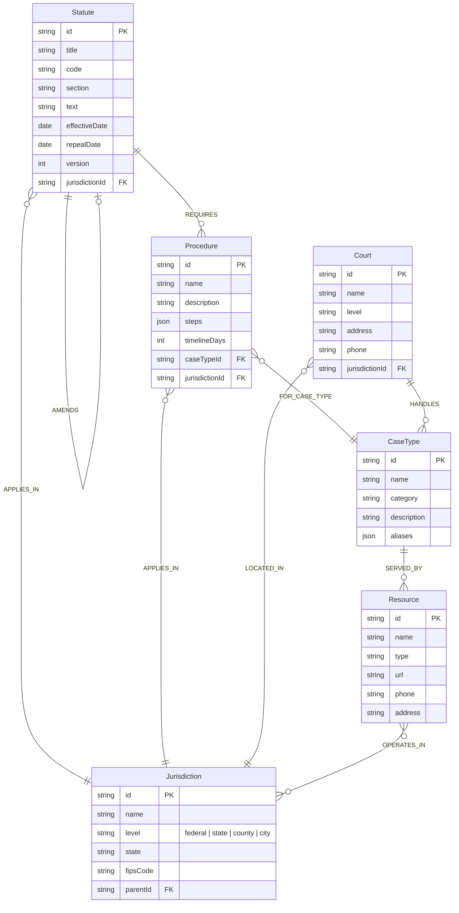

# Data Model — Justice Knowledge Graph

Entity-relationship diagram showing the graph node types and their relationships.

## Relationship Descriptions

| Relationship | Source | Target | Meaning |
|---|---|---|---|
| **REFERENCES** | Statute | Statute | Cross-reference citation between statutes |
| **SUPERSEDES** | Statute | Statute | Newer version replaces older version |
| **AMENDS** | Statute | Statute | Partial modification of a statute |
| **APPLIES_IN** | Statute/Procedure | Jurisdiction | Geographic applicability |
| **REQUIRES** | Statute | Procedure | Statute mandates a specific procedure |
| **FOR_CASE_TYPE** | Procedure | CaseType | Procedure applies to a specific case type |
| **SERVED_BY** | CaseType | Resource | Legal resource serving a case type |
| **LOCATED_IN** | Court | Jurisdiction | Court is physically located in a jurisdiction |
| **HANDLES** | Court | CaseType | Court has jurisdiction over a case type |
| **OPERATES_IN** | Resource | Jurisdiction | Resource provides services in a jurisdiction |
